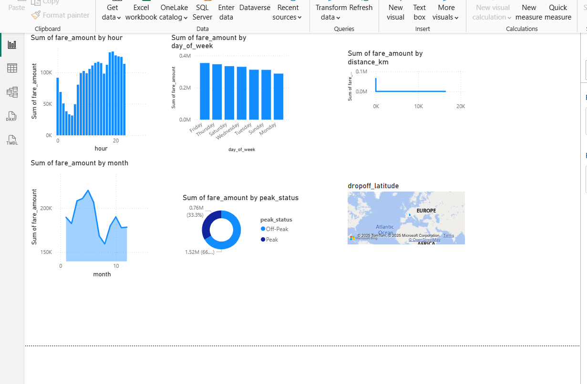
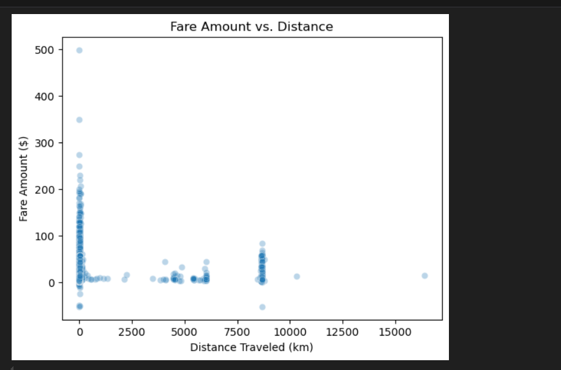

# YABESI-SPROJECT
This are my findings on uber feras dataset
# Uber Fares Dataset Analysis using Power BI

##  Introduction

This project is part of the *Introduction to Big Data Analytics (INSY 8413)* course and focuses on analyzing the Uber Fares Dataset obtained from Kaggle. The goal is to uncover insights about fare trends, ride patterns, and key operational metrics by performing data cleaning, exploratory data analysis (EDA), feature engineering, and building an interactive Power BI dashboard.

---

##  Objectives

- Analyze fare patterns and ride behavior using data visualization techniques.
- Extract actionable insights through temporal and spatial data analysis.
- Develop a professional, interactive Power BI dashboard.
- Demonstrate strong data storytelling and reporting skills.

---

##  Tools and Technologies

- **Python (Pandas)** – For data cleaning and preparation  
- **Power BI Desktop** – For data visualization and dashboard creation  
- **GitHub** – For version control and project documentation  
- **Dataset Source**: [Uber Fares Dataset – Kaggle](https://www.kaggle.com/datasets/yasserh/uber-fares-dataset)

---

##  Methodology

### 1. Data Preparation (Python)
- Loaded raw data into a Pandas DataFrame
- Assessed data types and performed data quality checks
- Removed null values and handled data inconsistencies
- Exported cleaned dataset to `uber_cleaned.csv`

### 2. Exploratory Data Analysis (EDA)
- Calculated descriptive statistics (mean, median, mode, std)
- Visualized fare distributions and outliers
- Investigated:
  - Fare amount vs. distance
  - Fare amount vs. time of day

### 3. Feature Engineering
- Extracted hour, day, month from `pickup_datetime`
- Created new columns like `day_of_week`, `peak_hour`
- Encoded necessary categorical features
- Saved final dataset as `uber_enhanced.csv`

### 4. Power BI Analysis
- Imported enhanced CSV into Power BI
- Created time series, histograms, and spatial visualizations
- Analyzed busiest ride times and seasonal fare trends
- Integrated filters and slicers for interactivity

---

##  Screenshots

### 🔹 Power BI Dashboard Preview
``` python
df['fare_amount'] = pd.to_datetime(df['fare_amount'])  
df['fare_amount'].value_counts().sort_index().plot(kind='line')
plt.title('fare distrubution  ')
plt.xlabel('fare_amount')
plt.ylabel('pickup_datetime')
plt.show()
```



### 🔹 EDA Visualization Samples

- **Fare Distribution**
  ``` python
df['fare_amount'] = pd.to_datetime(df['fare_amount'])  
df['fare_amount'].value_counts().sort_index().plot(kind='line')
plt.title('fare distrubution  ')
plt.xlabel('fare_amount')
plt.ylabel('pickup_datetime')
plt.show()
```

  

- **Fare vs Distance**  
  

---

## 📁 Project Structure

---

##  Key Findings

- Rides taken during peak hours tend to have higher fare amounts.
- Short-distance rides within the city contribute to most of the total ride count.
- Fare prices vary significantly based on time of day and day of the week.

---

##  Recommendations

- **Optimize pricing** during peak hours based on demand.
- **Target promotions** on low-activity days (e.g., Mondays).
- **Use location-based analysis** for surge pricing and dispatch planning.

---

##  Author

**NIYONKURU YABESI**  
Medical Laboratory Scientist & Data Enthusiast  
  Email: [Your Email]  
  Course: Introduction to Big Data Analytics, AUCA  
  Instructor: Eric Maniraguha | [LinkedIn](https://www.linkedin.com/in/ericmaniraguha/)

---

##  License

This project is licensed under the MIT License – feel free to use, modify, and share.

---


